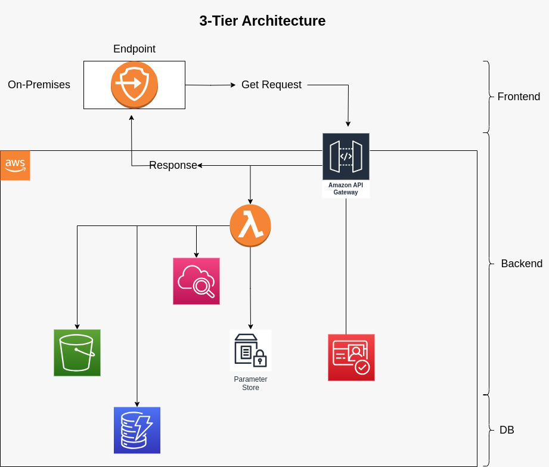
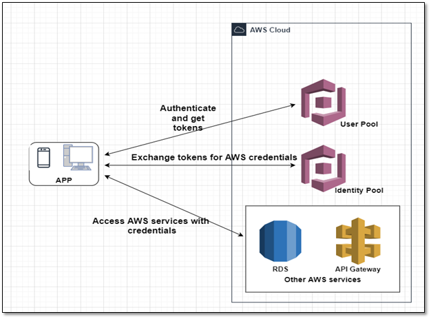

# Project AWS Lab – IITC

The project allow us to set up a system that allows users to access a frontend Web app through API Gateway, authenticate using Amazon Cognito, and interact with various AWS services such as DynamoDB, S3 Bucket, Lambda function, and CloudWatch. Additionally, the user message is customizable using a value stored in Parameter Store.

# Introduction to Serverless REST API on AWS Cloud using Terraform

This repository provides the necessary infrastructure-as-code (IAC) using Terraform to deploy a Serverless REST API on the AWS Cloud. The API leverages various AWS services, including API Gateway, AWS Lambda, Amazon Cognito, S3 Bucket, DynamoDB, and Amazon CloudWatch, to create a secure and scalable solution for user authentication and data storage.

# Why Choose a Serverless REST API?

A Serverless REST API offers several advantages and benefits compared to traditional server-based architectures. Here are some reasons why choosing a Serverless approach for a REST API can be beneficial:

1. **Scalability:** Serverless architectures automatically scale up and down based on demand. The infrastructure is managed by the cloud provider, which ensures that resources are allocated dynamically as needed. This means that the API can handle sudden spikes in traffic without manual intervention.

2. **Cost-Effective:** With a Serverless architecture, you only pay for the actual resources used during execution. There are no fixed costs for maintaining servers when the API is not in use. This pay-as-you-go model can result in cost savings, especially for applications with varying traffic patterns.

3. **No Server Management:** In a Serverless architecture, developers do not need to manage or maintain servers. This reduces the operational burden and allows them to focus more on building and deploying code.

4. **Faster Time-to-Market:** Serverless platforms abstract away much of the infrastructure setup and configuration, enabling faster development and deployment cycles. Developers can quickly iterate and release new features without the need to provision or manage servers.

5. **Automatic High Availability:** Serverless services are designed to be highly available and fault-tolerant by default. Cloud providers manage redundancy and failover, ensuring that the API remains accessible even in the event of hardware or software failures.

6. **Seamless Integrations:** Serverless services are typically designed to work well with other cloud services. This allows developers to easily integrate additional services such as databases, storage, authentication, and monitoring.

7. **Reduced Overhead:** Serverless architectures handle tasks like load balancing, auto-scaling, and server provisioning automatically. This reduces the operational overhead for the development team and the need for specialized DevOps skills.

8. **Elasticity:** Serverless platforms can automatically scale resources up or down in response to changes in traffic, ensuring that the API can handle varying workloads efficiently.

9. **Security:** Cloud providers invest heavily in security measures for their Serverless services. This includes regular updates, patches, and protection against common threats, helping to enhance the overall security of the API.

10. **Global Reach:** Serverless REST APIs deployed on cloud platforms have a global reach, enabling easy access to users from different geographic locations.

Despite these benefits, it's essential to consider the specific requirements and characteristics of the application before choosing a Serverless approach. While Serverless architectures offer great advantages for many use cases, they might not be the best fit for all scenarios, especially when dealing with long-running processes or highly specialized hardware requirements. As with any architectural decision, it's essential to evaluate trade-offs and consider factors such as latency, cost, and application complexity.

## Overview of the Solution

The Serverless REST API follows a series of steps to enable users to access the frontend, authenticate with their credentials using Amazon Cognito, and interact with other AWS services seamlessly. The high-level steps include:

## Steps for User Interaction

1. **User Authentication with Amazon Cognito**
   - A user will access the frontend through API Gateway.
   - The user will be prompted to enter their username and password for authentication.
   - Amazon Cognito handles the authentication process and verifies the user's credentials.

2. **Successful Authentication: Storing User Information**
   - Upon successful authentication, the system will record the user's information (e.g., username, date, and time) into a DynamoDB table.
   - The DynamoDB table will store relevant user details for future reference and analysis.

3. **Creating a File in S3 Bucket**
   - After successful authentication, the system will create a file in an S3 bucket, using the users name as the file name.
   - The content of the file will be the current date and time, indicating the time of the user's successful authentication.

4. **Logging Authentication Activity to CloudWatch**
   - The system will log successful authentication to Amazon CloudWatch.

5. **Customizable User Message from Parameter Store**
   - The system will send a message back to the user with a customized greeting, "hello, " followed by the user's name.
   - The specific greeting message can be retrieved from the Parameter Store.
   - This approach allows for easy customization of the user message without modifying the code.

## AWS Resources Used

The solution involves the use of the following AWS resources:

- **AWS API Gateway:**
  - API Gateway provides the frontend interface for users to interact with the system.
  
- **Amazon Cognito:**
  - Amazon Cognito handles user authentication, securely storing user credentials, and validating access.

  

- **Lambda Function:**
  - A Lambda function is responsible for processing authentication requests, writing user information to DynamoDB, creating files in the S3 bucket, and sending the personalized greeting message.

- **S3 Bucket:**
  - An S3 bucket is used to store files created during the authentication process, with each file named after the respective user.

- **DynamoDB:**
  - DynamoDB serves as the database to store user information, such as usernames and timestamps of successful authentications.

- **Amazon CloudWatch:**
  - CloudWatch is used to log both successful and failed authentication attempts, providing insights into system activity.

- **Parameter Store:**
  - Parameter Store is utilized to store the customizable user greeting message, allowing for easy modification without code changes.

## Instructions for Deployment

To deploy this solution, follow the steps below:

1. Set up the required AWS resources, including API Gateway, Amazon Cognito, Lambda function, S3 Bucket, DynamoDB, and Parameter Store.

2. Configure the Lambda function to handle authentication requests, write data to DynamoDB, create files in S3, log activity to CloudWatch, and retrieve the customizable greeting message from Parameter Store.

3. Integrate the Lambda function with API Gateway to enable user interaction with the frontend.

4. Configure Amazon Cognito to handle user authentication and access control.

5. Test the system thoroughly to ensure all components are functioning as expected.

6. Optionally, customize the user greeting message by updating the value stored in Parameter Store.

7. Document the deployment steps, system architecture, and any additional configurations for future reference and maintenance.

By following these steps, you will have successfully implemented a system that allows users to access the frontend, authenticate using Amazon Cognito, interact with various AWS services, and receive a personalized greeting message. The system is designed to be scalable, secure, and easily maintainable. Happy coding!

## Prerequisites

Before deploying the Amazon Cognito identity platform, make sure you have the following prerequisites:

- AWS account credentials with appropriate permissions
- Terraform installed on your local machine

## Getting Started

Follow the steps below to deploy the Amazon Cognito identity platform:

1. Clone this repository to your local machine.

2. Navigate to the repository directory.

3. Update the `variables.tf` file with your desired configuration, such as the API name, region, and stage name.

4. Initialize Terraform by running the following command:
terraform init

5. Preview the resources that will be created by running the following command:
terraform plan

6. Deploy the infrastructure by running the following command:
terraform apply -auto-approve

7. After the deployment is complete, you will see the API Gateway URL and other relevant outputs. You will need to add user to the pool, run the following bash:

**Add User**
#!/bin/bash

user_pool_id=$(terraform output -raw user_pool_id)
#api_gateway_arn=$(terraform output -raw  api_gateway_arn | cut -d ":" -f 6)
client_id=$(terraform output -raw client_id)

#echo "api_gateway_arn: $api_gateway_arn"
echo "User pool id: $user_pool_id"
echo "Client id of the cognito user pool client: $client_id"

#Prompt for username, password, and name
read -p "Enter your Cognito username: " username
echo # Move to the next line after username input
echo "Please enter your password 8 characters, 1 number, and 1 special character, and 1 capital letter"
read -s -p "Enter your Cognito password: " password
echo # Move to the next line after password input
read -p "Enter your name: " name

aws cognito-idp sign-up \
    --client-id $client_id \
    --username "$username" \
    --password "$password" \
    --user-attributes Name="email",Value="$username" Name="name",Value="$name" \
    --region us-west-1 \
    --profile default

aws cognito-idp admin-confirm-sign-up \
    --user-pool-id $user_pool_id \
    --username "$username" \
    --region us-west-1 \
    --profile default

aws cognito-idp admin-update-user-attributes \
    --user-pool-id $user_pool_id \
    --username "$username" \
    --user-attributes Name=email_verified,Value=true \
    --region us-west-1 \
    --profile default

8. Test the API by sending requests to the API Gateway URL. Make sure to include the necessary authentication headers if required. Try the following command example:

**Test User**
#!/bin/bash

#Prompt for username and password
read -p "Enter your Cognito username: " username
read -s -p "Enter your Cognito password: " password
echo # Move to the next line after password input

user_pool_id=$(terraform output -raw user_pool_id)
api_gateway_arn=$(terraform output -raw  api_gateway_arn | cut -d ":" -f 6)
client_id=$(terraform output -raw client_id)

echo "api_gateway_arn: $api_gateway_arn"
echo "User pool id: $user_pool_id"
echo "Client id of the cognito user pool client: $client_id"

TOKEN=$(aws cognito-idp initiate-auth \
    --auth-flow USER_PASSWORD_AUTH \
    --client-id $client_id \
    --auth-parameters USERNAME=$username,PASSWORD=$password \
    --query 'AuthenticationResult.IdToken' \
    --output text)

echo TOKEN: $TOKEN

curl -X GET https://$api_gateway_arn.execute-api.us-west-1.amazonaws.com/stage-01/users \
    -H "Authorization: Bearer $TOKEN"

## Folder Structure

- `main.tf`: Defines the main Terraform configuration and other dependencies.

- `variables.tf`: Contains the variable definitions used in the Terraform configuration.

- `outputs.tf`: Defines the outputs that are displayed after the deployment.

- `cognito.tf`: Sets up the Cognito user pool and app client for user authentication.

- `lambda_function.zip`: Contains the Lambda function code in a ZIP file.

- `README.md`: Provides instructions and information about the deployment.

- `API_Gateway.tf`: includes the resources for API Gateway and GET method.

- `dynamodb.tf`: Sets up the dynamoDB database resource.

- `s3.tf`: Sets up the s3 bucket, for storage.

- `ssm_param`: Creates the customizable user greeting message, allowing for easy modification without code changes.

## Cleanup

To clean up and delete the resources created by Terraform, run the following command:
terraform destroy -auto-approve

## Conclusion

With this Terraform code, you have successfully deployed the Amazon Cognito identity platform infrastructure, including API Gateway, Lambda function, and Cognito user pool. Feel free to customize and extend the code to meet your specific requirements.
